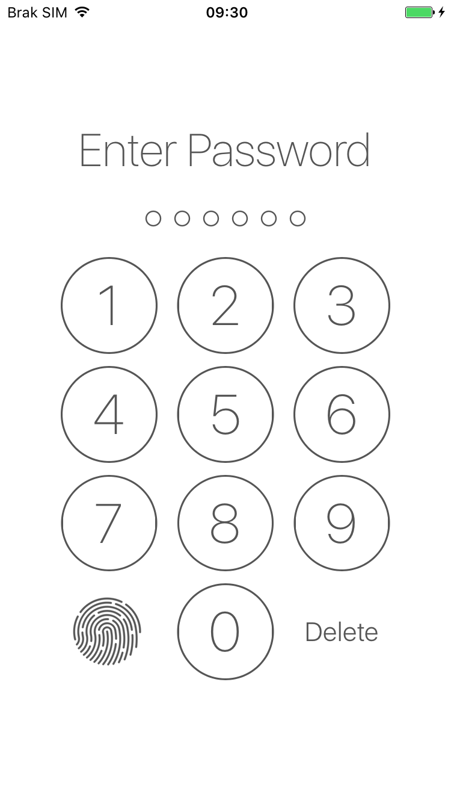

# SmileLock

[](https://github.com/recruit-lifestyle/Smile-Lock/issues)
<a href="https://github.com/Carthage/Carthage/"></a>
[](http://cocoadocs.org/docsets/SmileLock)
[](http://cocoadocs.org/docsets/SmileLock)
[](http://cocoadocs.org/docsets/SmileLock)

A library for make a beautiful Passcode Lock View, also support Touch ID.


# Requirements

- iOS 9.0+
- Swift 4 (pod version 3.x), Swift 3 (pod version 2.x), Swift 2.3 (pod version 1.x)

# What can it do for you?


#### 1. Create a beautiful passcode lock view simply.

``` swift
let kPasswordDigit = 6
passwordContainerView = PasswordContainerView.create(withDigit: kPasswordDigit)
```

#### 2. Passcode input completed delegate callback.

``` swift
let passwordContainerView: PasswordContainerView = ...
passwordContainerView.delegate = self

extension ViewController: PasswordInputCompleteProtocol {
    func passwordInputComplete(passwordContainerView: PasswordContainerView, input: String) {
        print("input completed -> \(input)")
        //handle validation wrong || success
    }
}

```

#### 3. Touch ID and Face ID

Thanks for the contribution of [Piotr Sochalewski](https://github.com/sochalewski).👍

``` swift
extension ViewController: PasswordInputCompleteProtocol {
     func touchAuthenticationComplete(passwordContainerView: PasswordContainerView, success: Bool) {
        if success {
            //authentication success
        } else {
            passwordContainerView.clearInput()
        }
    }
}
```


#### Face ID requirements

Using Face ID requires adding `NSFaceIDUsageDescription` to your `Info.plist` otherwise the app would crash trying to use it.

#### 4. Customize UI.

``` swift
passwordContainerView.tintColor = UIColor.color(.textColor)
passwordContainerView.highlightedColor = UIColor.color(.blue)
```

#### 5. Visual Effect.
If you want to see no visual effect, change the property `isBlurUI` to `false` in `HomeViewController.swift`.


#How to use it for your project?

SmileLock is available through use [CocoaPods](http://cocoapods.org).

To install it, simply add the following line to your Podfile:

```Ruby
pod 'SmileLock'
```
Or you can drag the [SmileLock](https://github.com/recruit-lifestyle/Smile-Lock/tree/master/SmileLock) folder to your project.

# Another Approach
You can subclass `PasswordUIValidation` for a more simple & elegant code. More detail please refer `BlurPasswordLoginViewController.swift`.

```swift
override func viewDidLoad() {
        super.viewDidLoad()

        //create PasswordUIValidation subclass
        passwordUIValidation = MyPasswordUIValidation(in: passwordStackView)

        passwordUIValidation.success = { [weak self] _ in
            print("*️⃣ success!")
            self?.alertForRightPassword { _ in
                self?.passwordUIValidation.resetUI()
            }
        }

        passwordUIValidation.failure = { _ in
            //do not forget add [weak self] if the view controller become nil at some point during its lifetime
            print("*️⃣ failure!")
        }

        ...
    }
```

# Contributions

* Warmly welcome to submit a pull request.

## Credits
SmileLock is owned and maintained by [RECRUIT LIFESTYLE CO., LTD.](http://www.recruit-lifestyle.co.jp/).

# License
```
Copyright (c) 2016 RECRUIT LIFESTYLE CO., LTD.
Licensed under the Apache License, Version 2.0 (the "License");
you may not use this file except in compliance with the License.
You may obtain a copy of the License at

    http://www.apache.org/licenses/LICENSE-2.0

Unless required by applicable law or agreed to in writing, software
distributed under the License is distributed on an "AS IS" BASIS,
WITHOUT WARRANTIES OR CONDITIONS OF ANY KIND, either express or implied.
See the License for the specific language governing permissions and
limitations under the License.
```
