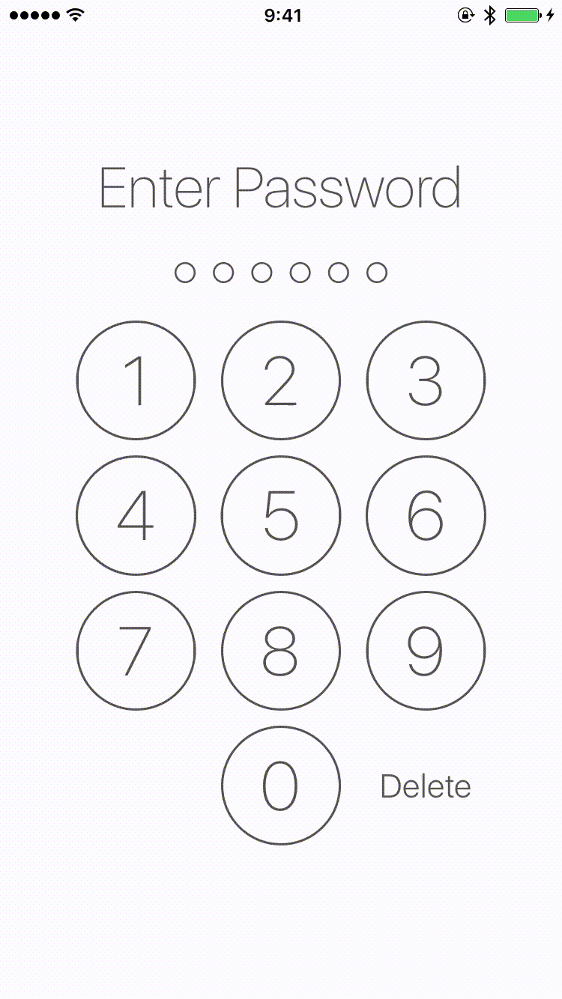

# SmileLock

[](https://github.com/liu044100/SmileLock/issues)
[](http://cocoadocs.org/docsets/SmileLock)
[](http://cocoadocs.org/docsets/SmileLock)
[](http://cocoadocs.org/docsets/SmileLock)

A library for make a beautiful Passcode Lock View.



#What can it do for you?


#### 1. Live rendering in Storyboard.


#### 2. Support customize Lock UI.


#How to use it for your project?

SmileLock is available through use [CocoaPods](http://cocoapods.org).

To install it, simply add the following line to your Podfile:

```Ruby
pod 'SmileLock'
```
Or you can drag the [SmileLock](https://github.com/liu044100/SmileLock/tree/master/SmileLock/Classes) folder to your project.

# Contributions

* Warmly welcome to submit a pull request.

# Contact

* If you have some advice or find some issue, please contact me.
* Email [me](liu044100@gmail.com)

# License

SmileLock is available under the MIT license. See the LICENSE file for more info.
