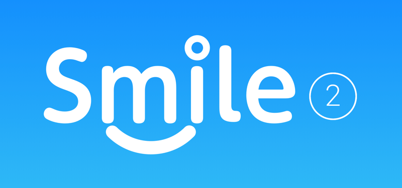
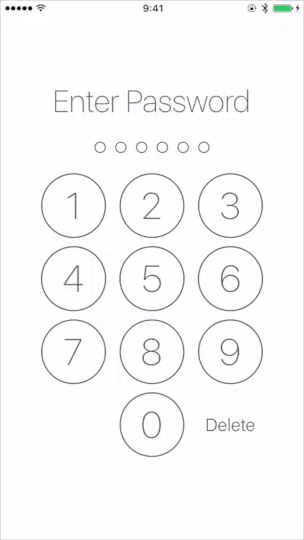
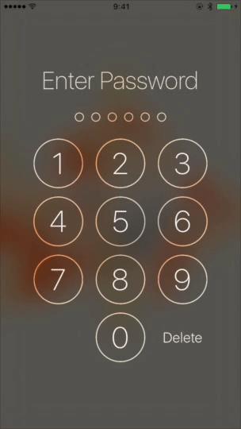
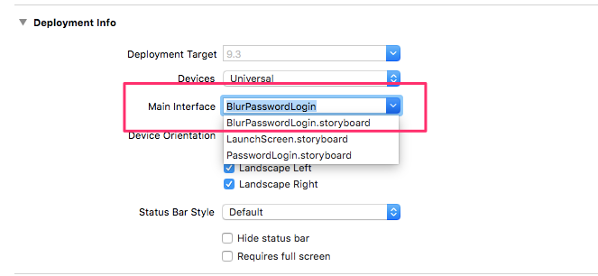

# SmileLock

[](https://github.com/liu044100/Smile-Lock/issues)
[](http://cocoadocs.org/docsets/SmileLock)
[](http://cocoadocs.org/docsets/SmileLock)
[](http://cocoadocs.org/docsets/SmileLock)

A library for make a beautiful Passcode Lock View.






#What can it do for you?


#### 1. Create a beautiful passcode lock view simply.

``` swift
let kPasswordDigit = 6
self.passwordContainerView = PasswordContainerView.createWithDigit(kPasswordDigit)
```

#### 2. Passcode input completed delegate callback.

``` swift
let passwordContainerView: PasswordContainerView = ...
passwordContainerView.delegate = self

extension ViewController: PasswordInputCompleteProtocol {
    func passwordInputComplete(passwordContainerView: PasswordContainerView, input: String) {
        print("input completed -> \(input)")
        //handle validation wrong || success
    }
}

```


#### 3. Customize UI.

``` swift
self.passwordContainerView.tintColor = UIColor.color(.TextColor)
self.passwordContainerView.hightlightedColor = UIColor.color(.Blue)
```

#### 4. Visual Effect.
Choose `BlurPasswordLogin.storyboard` as main storyboard.



#How to use it for your project?

SmileLock is available through use [CocoaPods](http://cocoapods.org).

To install it, simply add the following line to your Podfile:

```Ruby
pod 'SmileLock'
```
Or you can drag the [SmileLock](https://github.com/liu044100/Smile-Lock/tree/master/SmileLock) folder to your project.

# Contributions

* Warmly welcome to submit a pull request.

# Contact

* If you have some advice or find some issue, please contact me.
* Email [me](liu044100@gmail.com)

# License

SmileLock is available under the MIT license. See the LICENSE file for more info.
